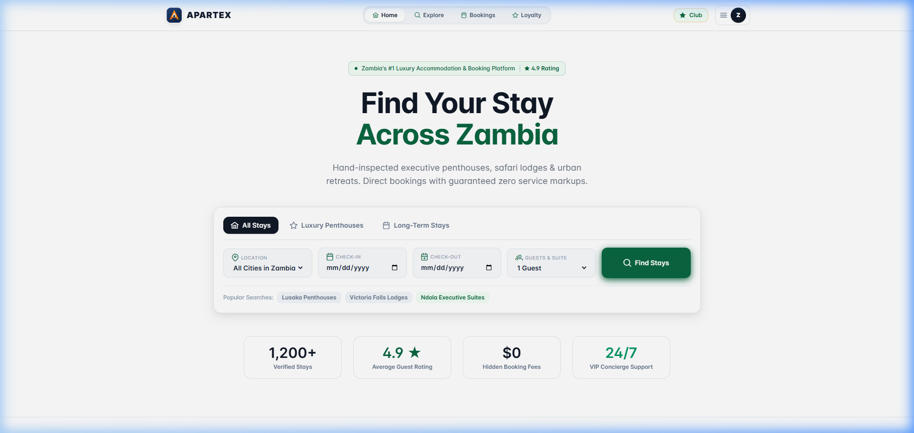
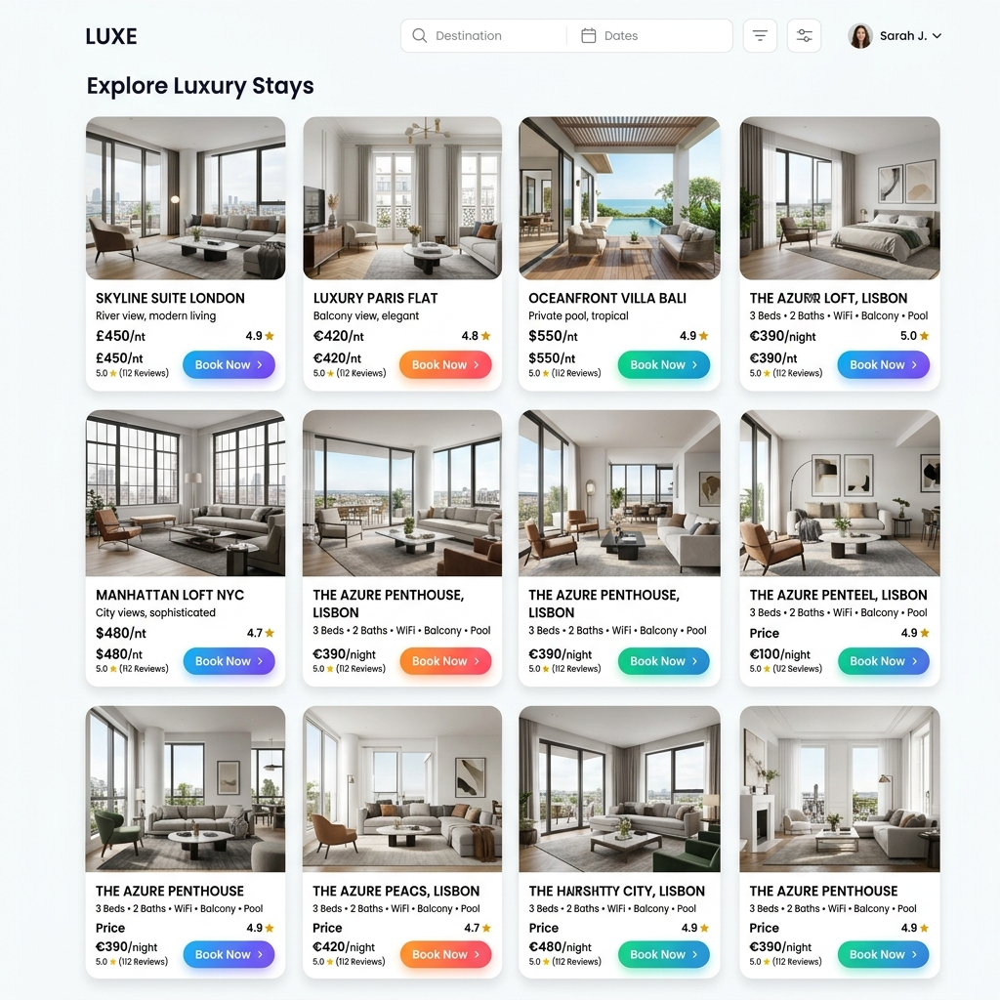
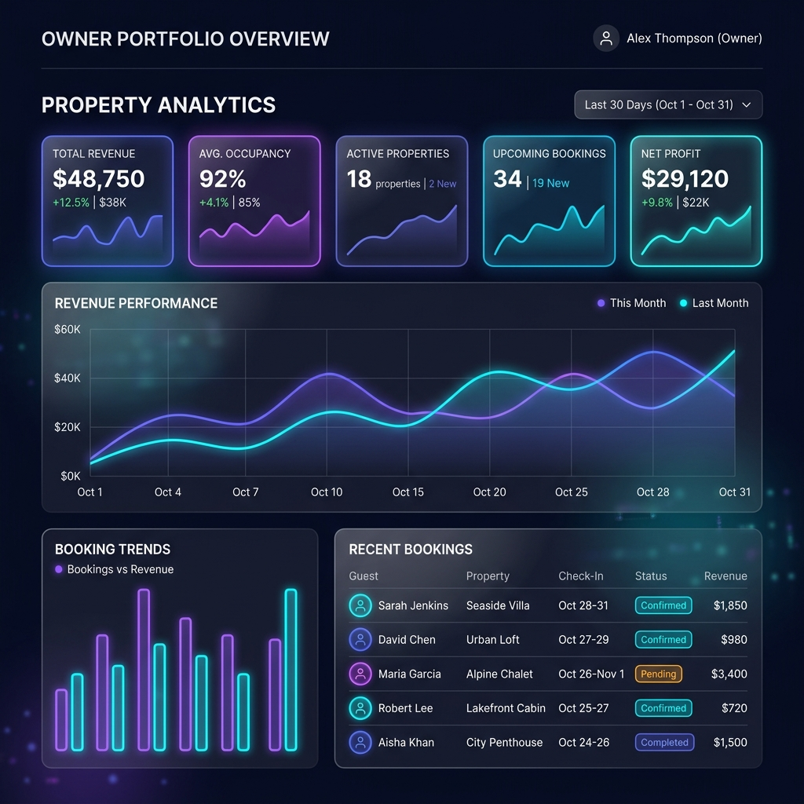

# 🏨 Apartex

**Apartex** is a premium apartment booking ecosystem designed to bridge the gap between luxury property owners and globetrotting guests. Built with a high-performance FastAPI backend and a reactive Vue.js 3 frontend, it offers a seamless experience for both property management and vacation discovery.

---

## ✨ Project Showcase


*Modern search and discovery interface featuring glassmorphism elements.*

<div align="center">
  
  
</div>

*Left: Premium apartment listing grid. Right: Comprehensive owner analytics dashboard.*

---

## 🚀 Vision & Key Features

### 💎 For Guests
- **🔍 Smart Search**: Find the perfect stay using advanced filtering and location-based discovery.
- **📅 Real-time Booking**: Instant confirmation with checking-in/out date validation.
- **🏆 Loyalty Rewards**: Earn points on every stay to unlock exclusive tiers and rewards.
- **💖 Wishlist**: Curate your dream vacation list with a single click.

### 📊 For Property Owners
- **🏠 Listing Management**: Create and manage detailed property profiles with image support.
- **📈 Advanced Analytics**: Track revenue, occupancy rates, and booking trends at a glance.
- **💰 Payout Tracking**: Transparent history of earnings and payout statuses.
- **🛡️ Secure Access**: Role-based authentication ensuring data privacy.

---

## 🛠️ Tech Stack & Architecture

### Backend (FastAPI)
- **FastAPI**: Asynchronous Python framework for high-throughput APIs.
- **SQLAlchemy 2.0**: Modern ORM for flexible database modeling.
- **JWT Auth**: Secure token-based authentication with refresh cycles.
- **Pydantic**: Robust data validation and serialization.

### Frontend (Vue 3)
- **Vue.js 3 + Vite**: Lightning-fast development and optimized build pipeline.
- **Pinia**: Centralized state management for complex reactive data.
- **PrimeVue**: High-quality UI component library.
- **Vanilla CSS**: Bespoke premium styling with glassmorphism and smooth transitions.

---

## 📈 Project Health & Development
We maintain high standards for code quality and security. For a detailed breakdown of current technical debt, security audits, and UI/UX recommendations, please refer to:

👉 **[View Project Audit Report](C:\Users\zakir\.gemini\antigravity\brain\6ff79adf-a3cc-4176-a870-ba2d422d47d4\project_audit_report.md)**

---

## 🏗️ Getting Started

### Prerequisites
- **Python 3.10+**
- **Node.js 18+**
- **SQLite** (Default) or PostgreSQL

### Quick Setup

1. **Backend**:
   ```bash
   cd backend
   python -m venv venv
   source venv/bin/activate # or venv\Scripts\activate
   pip install -r requirements.txt
   uvicorn main:app --reload
   ```

2. **Frontend**:
   ```bash
   cd frontend/apartex-frontend
   npm install
   npm run dev
   ```

---

## 🤝 Contributing & License
Contributions are welcome! Please feel free to submit a Pull Request.  
Distributed under the **MIT License**. Created by **Zakir Motala**.


