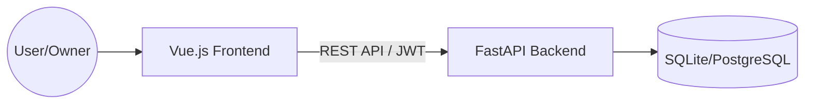

# 🏗️ Apartex Architecture Overview

This document provides a high-level overview of the Apartex system architecture, data flow, and technical design decisions.

---

## 🛰️ System Context
Apartex is a decoupled web application consisting of a modern frontend client and a high-performance RESTful API.

---

## 📱 Frontend Architecture (Vue 3)

The frontend is built with **Vue 3** and **Vite**, prioritizing performance and developer experience.

### 🧩 Core Modules
- **Views**: Page-level components (e.g., `HomeView`, `DashboardView`).
- **Components**: Reusable UI elements (e.g., `ApartmentCard`, `BookingForm`).
- **Stores (Pinia)**: Centralized state management for Auth, Apartments, and Bookings.
- **API Client (Axios)**: Abstracted service layer with interceptors for JWT handling.
- **Router**: Role-based navigation guards (Guest vs. Owner).

### 🔐 Authentication Flow
1. User logs in via `LoginView`.
2. Backend returns a JWT `access_token`.
3. `authStore` saves the token in `localStorage` and application state.
4. Axios Interceptor injects the token into the `Authorization` header for subsequent requests.
5. If a `401 Unauthorized` response is received, the interceptor clears the token and redirects to the login page.

---

## ⚙️ Backend Architecture (FastAPI)

The backend follows a layered architecture to separate concerns and ensure maintainability.

### 📁 Layered Structure
- **Routers**: Define API endpoints and handle request validation (via Pydantic).
- **Services**: Contain business logic (e.g., calculating loyalty points, processing payouts).
- **Models**: SQLAlchemy ORM definitions for database tables.
- **Schemas**: Pydantic models for request/reponse serialization and validation.
- **Core**: Global configuration, security utilities, and exception handlers.

### 🗄️ Database Design
The application uses **SQLAlchemy 2.0**. While SQLite is the default for development, it is designed to be compatible with PostgreSQL for production environments.

#### Key Entities:
- **User**: Guests and Owners (Role-based).
- **Apartment**: Listings with metadata, pricing, and owner associations.
- **Booking**: Reservation details, dates, and payment status.
- **LoyaltyReward**: Points balance and redemption history.
- **Review**: Guest-provided feedback and ratings.

---

## 🛠️ Key Technical Decisions

### 🎨 Glassmorphism UI
We chose a bespoke **Vanilla CSS** approach for styling to achieve a premium "Glassmorphism" look that is difficult to replicate with standard utility-first frameworks without significant customization.

### ⚡ Asynchronous Backend
FastAPI's `async/await` support is leveraged to handle high-concurrency scenarios, especially useful for future real-time features like chat or live availability updates.

### 🛡️ Enhanced Security
Passwords are hashed using `bcrypt` with configurable rounds. JWT tokens have a defined expiration, and the system is ready for refresh token implementation (see `auth_enhanced.py`).

---

## 🚀 Deployment Strategy
- **Frontend**: Optimized static build served via Vercel/Netlify.
- **Backend**: Containerized with Docker and deployed to a cloud provider (e.g., AWS, DigitalOcean).
- **CI/CD**: GitHub Actions for automated linting, testing, and deployment.
