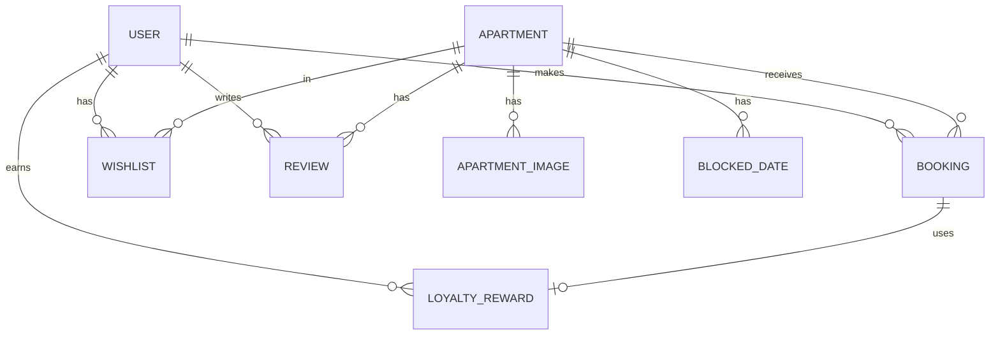

# 🗄️ Database Schema

Apartex uses a relational database schema managed by **SQLAlchemy**. This document describes the tables, their columns, and the relationships between them.

---

## 🗺️ Entity Relationship Diagram (Conceptual)

---

## 📋 Tables

### `users`
Stores guest and owner information.
- `id` (PK): Unique identifier.
- `email` (Unique): User's email address.
- `hashed_password`: Bcrypt hashed password.
- `full_name`: User's full name.
- `role`: `renter` (Guest) or `owner`.
- `loyalty_points`: Current balance of loyalty points.
- `loyalty_tier`: `bronze`, `silver`, or `gold`.
- `total_bookings`: Counter for completed stays.

### `apartments`
Stores property listings.
- `id` (PK): Unique identifier.
- `owner_id`: Reference to the user who owns the property.
- `title`: Short name of the apartment.
- `description`: Detailed text description.
- `address`, `city`: Location details.
- `price_per_night`: Base cost for one night.
- `capacity`, `bedrooms`, `bathrooms`: Property specs.
- `amenities`: JSON string of available features.
- `image_url`: Primary display image.

### `bookings`
Stores reservation records.
- `id` (PK): Unique identifier.
- `apartment_id` (FK): The apartment being booked.
- `user_id` (FK): The user making the booking.
- `check_in`, `check_out`: Stay dates.
- `total_price`: Total cost of the stay.
- `status`: `pending`, `confirmed`, `completed`, `cancelled`.
- `earned_loyalty_points`: Points granted for this stay.
- `used_reward_id` (FK): Reference to a reward applied to this booking.

### `loyalty_rewards`
Stores available and used rewards.
- `id` (PK): Unique identifier.
- `user_id` (FK): Owner of the reward.
- `reward_type`: `free_night`, `percentage_discount`.
- `reward_value`: Value associated with the type.
- `status`: `available`, `used`, `expired`.

### `reviews`
Guest feedback on apartments.
- `id` (PK): Unique identifier.
- `apartment_id` (FK): The apartment reviewed.
- `user_id` (FK): The author of the review.
- `rating`: 1 to 5 stars.
- `comment`: Text feedback.

### `apartment_images`
Gallery of images for an apartment.
- `id` (PK): Unique identifier.
- `apartment_id` (FK): Associated apartment.
- `url`: Image storage location.

### `blocked_dates`
Calendar management for owners.
- `id` (PK): Unique identifier.
- `apartment_id` (FK): Associated apartment.
- `date`: Specific date marked as unavailable.
- `reason`: Why the date is blocked.

---

## 🛠️ Data Types & Constraints
- **Passwords**: Hashed with `bcrypt`.
- **Prices**: Stored as `Numeric(10, 2)` for precision.
- **Dates**: Stored as `Date` (for bookings) and `DateTime` (for timestamps).
- **JSON**: Amenities are stored as serialized JSON strings for flexibility.
